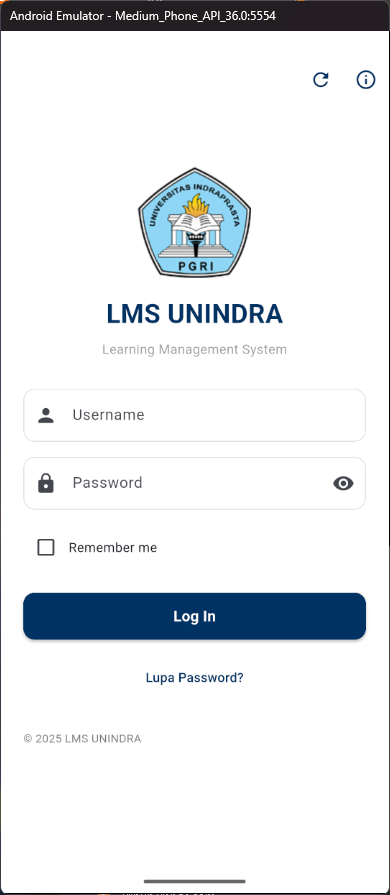
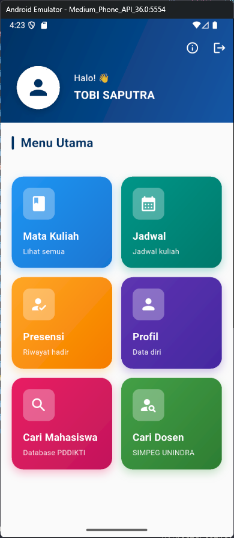
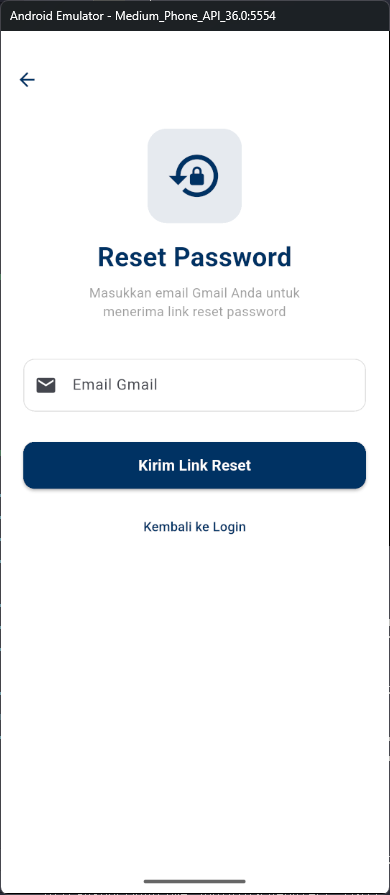
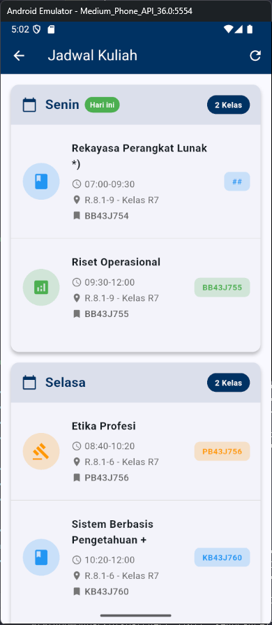
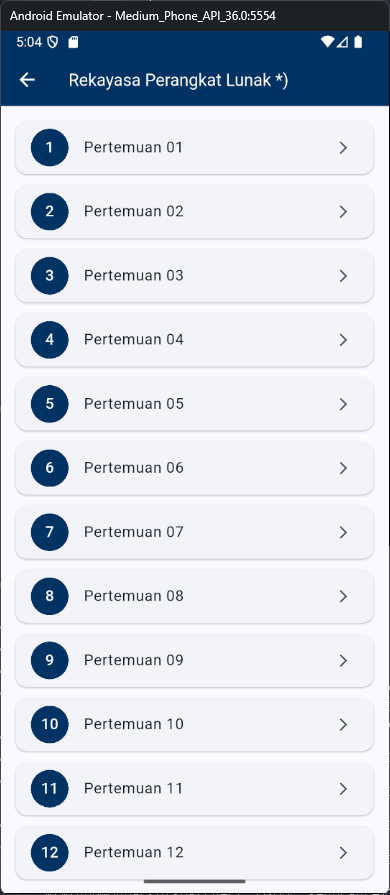
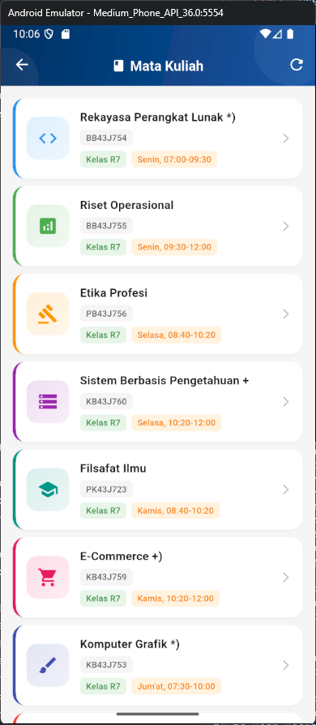
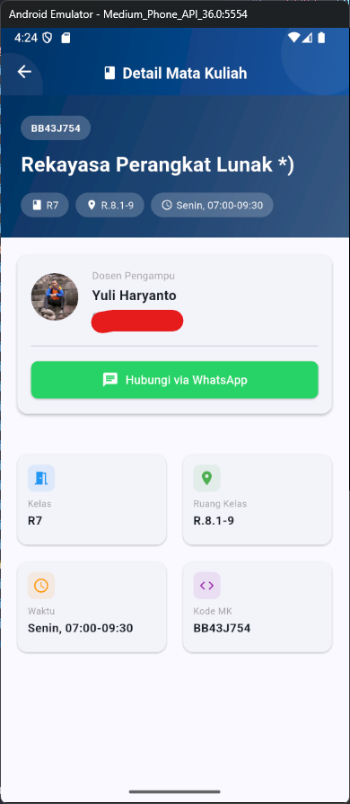
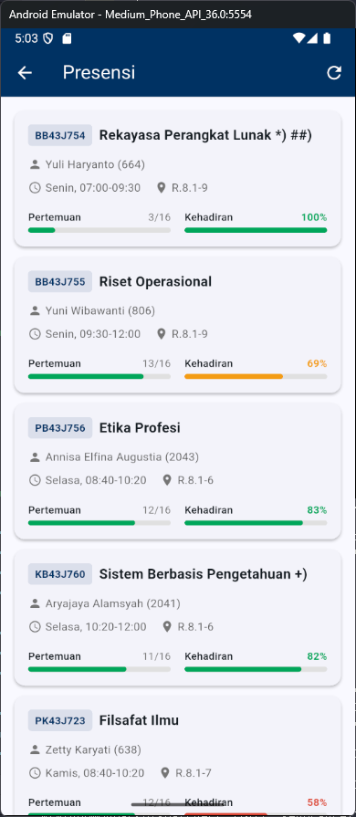
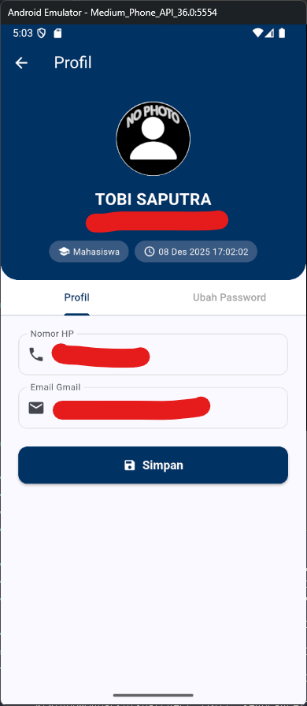

# LMS UNINDRA Mobile

Aplikasi mobile buat akses LMS UNINDRA, buat bikin gampang akses materi kuliah dari HP.

## Releases

- [v1.0.1 - Latest Release](https://github.com/TobyG74/LMSUnindraMobile/releases/tag/v1.0.1)
- [v1.0.0 - Initial Release](https://github.com/TobyG74/LMSUnindraMobile/releases/tag/v1.0.0)

## Screenshots

### Login, Dashboard, Presensi
<p align="center">
  
  
  
</p>


### Jadwal Kuliah
<p align="center">
  
  
</p>

### Mata Kuliah
<p align="center">
  
  
</p>

### Pertemuan & Materi
<p align="center">
  
  
</p>

## Tabel Konten

- [Fitur](#fitur)
- [Tech Stack](#tech-stack)
- [Instalasi](#instalasi)
- [Build Aplikasi](#build-aplikasi)
- [Auto Solve Captcha](#auto-solve-captcha)
- [Struktur Project](#struktur-project)
- [License](#license)

## Fitur

- Login otomatis (captcha auto-solve pake OCR)
- Remember me buat nyimpen login
- Dashboard yang simpel
- Jadwal kuliah dengan indikator hari ini
- Presensi
- Materi pertemuan dengan badge "Baru"
- Download materi (PDF, Word, PPT, Excel, dll)
- Upload tugas dengan validasi deadline
- Google Meet integration
- Forum diskusi
- URL eksternal

## Tech Stack

- Flutter
- Dio (HTTP client)
- Google ML Kit (buat OCR captcha)
- Provider (state management)
- Shared Preferences
- Cookie Manager

## Instalasi

### Yang dibutuhin:

- Flutter SDK (minimal versi 3.0.0)
- Android SDK / Xcode
- Internet

### Cara install:

1. Clone repo ini
2. Install dependencies:

```bash
flutter pub get
```

3. Jalanin aplikasi:

```bash
flutter run
```

## Build Aplikasi

### Android APK

```bash
flutter build apk --release
```

### iOS

```bash
flutter build ios --release
```

## Auto Solve Captcha

Fitur auto solve captcha pake Google ML Kit buat baca soal matematika di captcha terus solve otomatis.

Support operasi:
- Tambah: `6+2=?`
- Kurang: `7-2=?`
- Kali: `8x2=?`
- Bagi: `9/3=?`

Cara kerjanya:
1. Ambil gambar captcha dari server
2. Pre-process gambar biar lebih jelas
3. OCR pake ML Kit
4. Parse soal matematika
5. Hitung & isi otomatis

## Struktur Project

```
lib/
├── main.dart
├── models/          # Model data
├── services/        # API & service layer
└── screens/         # UI screens
```

## License

[MIT License](https://github.com/TobyG74/LMSUnindraMobile/blob/master/LICENSE)

---
